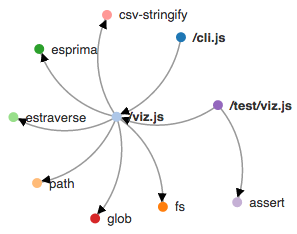

# jsviz

For visualizing the internal and external dependencies of a JavaScript codebase. Takes a directory to analyze and outputs a graph representation in HTML.

Uses `esprima` and `estraverse` to walk the syntax tree, pick out any `require()` calls, and generate a dependency graph. Generates an HTML file and uses `d3` to visualize the graph. Example output (of this project):



## Usage

From the command line, pass in a directory (that you want analyed) and an output file:

```bash
npm i -g jsviz

jsviz ~/taco-project > taco-project-viz.html
```

From JavaScript:

```bash
npm i jsviz
```

```javascript
var jsviz = require('jsviz');

// Grab the dependency graph
jsviz.graph('~/taco-project', function (err, graph) {

});

// Turn the graph into html
jsviz.html(graph, function (err, html) {

});
```
